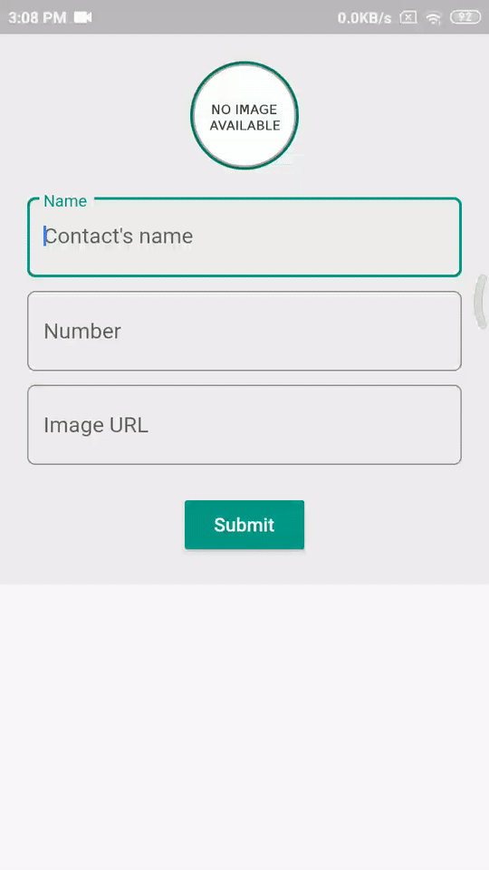

<h3 align = "center"> <b>Implementation of Seach from hive with provider</b> </h3>

		

 <b>This is an example app for a medium article, which shows the implementation of Search, fetching from Hive database for flutter.</b>

## Demo

 

## Dependencies

This project depends upon the following packages
- hive: ^1.4.4+1
- hive_flutter: ^0.3.1
- path_provider: ^1.6.24
- provider: ^4.3.3
- build_runner: ^1.10.11
- hive_generator: ^0.8.2

### If this repo has helped you in any way then please considering starring this repo or also you can

